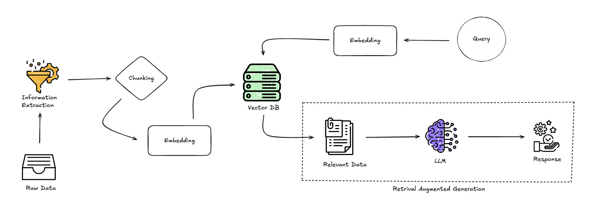
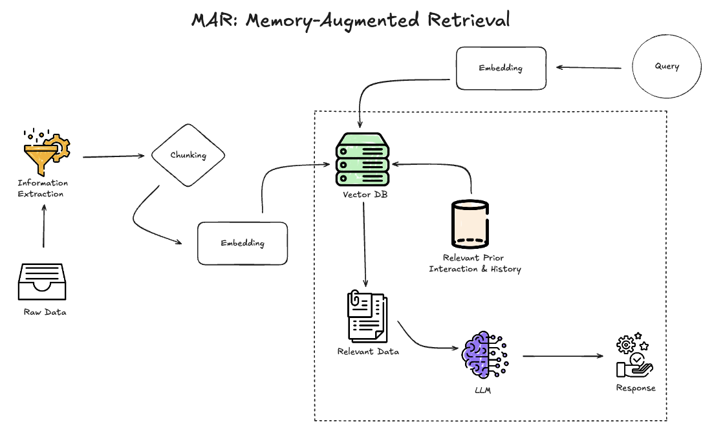
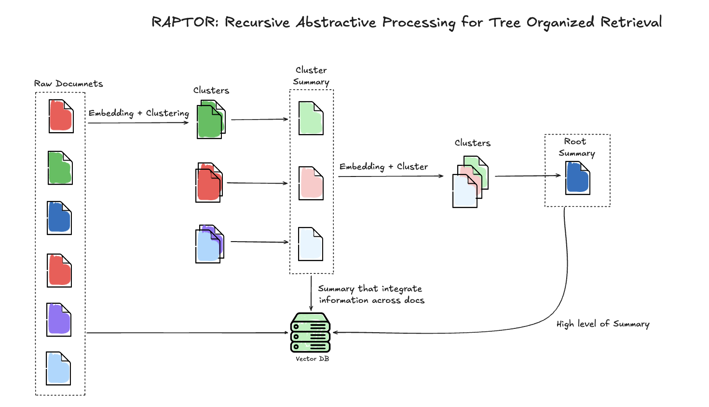

# Capstone Weekly Report

### Date: Sep 03, 2024
- **Topics of Discussion:**
    - **RAG (Retrieval-Augmented Generation):** Understanding the framework and its applications.
    - **LangChain:** Introduction to the library and its role in RAG systems.
    - **Multi-Agent System:** Exploration of how multiple agents can be used to enhance the performance of language models.

- **Action Items:**
    * [&check;] Deep dive into RAG architecture.
    * [&check;] Explore practical use cases for LangChain in RAG.
    * [&check;] Research potential benefits of multi-agent systems in language models.

---

### Date: Sep 10, 2024
- **Topics of Discussion:**
    - **Project Workflow:** Created a general diagram to outline the workflow and architecture.
    - **Dataset Identification:** Found a suitable dataset for the project.
    - **RAG Pipeline:** Built a simple RAG pipeline using basic components.
    - **Model Experimentation:** Tested different models for embeddings and evaluated their effectiveness.
    - **LLM Integration:** Integrated an initial version of a Language Model (LLM) into the pipeline.

## Basic RAG Diagram

- **Action Items:**
    * [&check;] Refine the project workflow diagram.
    * [&check;] Conduct more experiments with different datasets.
    * [&check;] Optimize the RAG pipeline with advanced components.
    * [&check;] Continue model experimentation for improved embeddings.
    * [&check;] Enhance LLM integration based on feedback.

---

### Date: Sep 17, 2024
- **Topics of Discussion:**
    - **Literature Review:** Plan to review relevant research related to RAG and multi-agent systems.
    - **Modular Code Structure:** Need to develop a code structure that supports scalability and testing.
    - **Testing Scripts:** Write and run test scripts to validate code functionality.
    - **Data Acquisition:** Start the process of data collection and cleaning.
    - **Data Exploration:** Continue testing data from various sources for suitability.

- **Action Items:**
    * [&check;] Conduct a thorough literature review on RAG and multi-agent systems.
    * [&check;] Design and implement a modular code structure.
    * [&check;] Develop and run test scripts for the codebase.
    * [&check;] Initiate data acquisition and cleaning process.
    * [&check;] Evaluate and test data from different sources for the project.

---

### Date: Sep 24, 2024
- **Topics of Discussion:**
    - **Test Folder Structure and Script Actions:** Refining the test folder structure and defining actions for testing vector store and embedding model.
    - **Main Folder Setup:** Creating a main folder to organize the main functions and core components of the project.
    - **PDF Parser Integration:** Integrating a PDF parser into the system to handle document processing.
    - **PDF Download Function:** Developing a Python function to download PDF documents from links mentioned in the data source of BioASQ - Task B.

- **Action Items:**
    * [&check;] Refine the folder structure for test scripts, specifically for vector store and embedding model.
    * [&check;] Define specific actions and test cases for validating vector store and embedding model functionalities.
    * [&check;] Create a main folder for organizing core functions and essential project components.
    * [&check;] Integrate a PDF parser into the system for handling document processing.
    * [&check;] Develop a Python function to download PDF documents from links mentioned in BioASQ - Task B data source.
    * [&check;] Test the PDF download function with a sample link and validate the parser's integration.

---

### Date: Oct 1, 2024
- **Topics of Discussion:**
    - **Score RAG:** Evaluating the performance of the Retrieval-Augmented Generation (RAG) system by scoring its results.
    - **Embedding Models:** Trying different models for embedding to optimize the RAG system's performance.
    - **Chunking Method:** Experimenting with various chunking methods to improve text processing and retrieval efficiency.
    - **RAG Pipeline:** Developing a complete pipeline for RAG with comprehensive testing for all its components.

- **Action Items:**
    * [&check;] Try different models for embedding and compare their results.
    * [&check;] Experiment with different chunking methods to optimize the chunk size and method.
    * [&check;] Build a complete pipeline for the RAG system, ensuring all components are tested and functioning.
    * [&check;] Test and record the retrieval at different values of k (e.g., k=5, 10, 20) to assess retrieval quality.

---

### Date: Oct 8, 2024
- **Topics of Discussion:**
    - **Embedding Comparison:** Plan to compare embeddings from NVIDIA and other open-source models.
    - **Data Preparation:** Ensure that at least 50 undamaged PDFs are available for testing.
    - **Embedding Evaluation:** Test and evaluate the performance of different embeddings on the prepared PDFs in table format.
    - **Performance Metrics:** Define and use key metrics (e.g., accuracy, speed, memory usage) to compare embeddings.
    - **Documentation:** Properly document the embedding comparison process and results.

- **Action Items:**
    * [&check;] Gather and prepare at least 50 not-damaged PDFs for testing.
    * [&check;] Implement the embedding process using both NVIDIA and open-source models.
    * [&check;] Define performance metrics for embedding evaluation in table format.
    * [&check;] Run embedding tests and evaluate results using the defined metrics.
    * [&check;] Document the process and findings from the embedding comparison.

---

### Date: Oct 22, 2024
- **Topics of Discussion:**
    - **Generation Model Development:** Focus on improving the generation step of the RAG pipeline, ensuring relevance and coherence in the generated outputs.
    - **Evaluation of Embedding, Retrieval, and Generation Models:** Plan to evaluate the embedding, retrieval, and generation stages using key metrics (e.g., embedding accuracy, retrieval F1 score, generation BLEU score).
    - **Proposal for New RAG Application:** Discuss a new potential RAG application for real-time legal document summarization, leveraging RAG's capability for precise document retrieval and coherent summary generation.
    - **Reporting and Visualization:** Begin the report on RAG evaluation, documenting results and creating a diagram to illustrate the evaluation flow and proposed application.

- **Action Items:**
    * [ ] Improve coherence and relevance of generated outputs in the RAG pipeline.
    * [ ] Define and finalize the evaluation metrics for embedding, retrieval, and generation stages.
    * [ ] Run embedding, retrieval, and generation tests, then evaluate the results using the defined metrics.
    * [ ] Draft a proposal for using RAG in real-time legal document summarization.
    * [ ] Start the report with metrics, and evaluation results, and create a diagram to visualize the evaluation process and proposed application.

---
## Basic MAR Diagram

## Basic RAPTOR Diagram

---
### Date: Nov 19, 2024

# Evaluation Results of Generation across Different RAGs
## Summary of Questions Across JSON Files (MAR, RAG, RAPTOR, RAPTOR+Memory)

### 1. Total Questions
- **Total Questions**: 13
  - **Answered**: 12 questions were answered in at least one JSON file.
  - **Very Close to Ideal**: 9 questions have answers that are very close to the ideal answer.
  - **Correct Answer**: 7 questions were correctly answered exactly as intended.

### 2. Individual JSON Breakdown
- **MAR**:
  - **Answered**: 11 out of 13 questions
  - **Very Close to Ideal**: 7
  - **Correct Answer**: 6
- **RAG**:
  - **Answered**: 11 out of 13 questions
  - **Very Close to Ideal**: 7
  - **Correct Answer**: 5
- **RAPTOR**:
  - **Answered**: 8 out of 13 questions
  - **Very Close to Ideal**: 3
  - **Correct Answer**: 3
- **RAPTOR+Memory**:
  - **Answered**: 10 out of 13 questions
  - **Very Close to Ideal**: 6
  - **Correct Answer**: 5

### 3. Overlap and Coverage
- The **MAR** and **RAG** files had the highest alignment with the ideal answers overall, both in terms of the number of questions answered and those very close to the ideal.
- **RAPTOR+Memory** outperformed standard RAPTOR by improving the total number of answered questions and increasing the number of answers close to or matching the ideal.
- **RAPTOR** provided the fewest answers and had the least alignment with the ideal answers, though it was able to deliver correct responses for some questions.

### 4. Insights
- **MAR and RAG** are reliable in providing answers that align closely with the ideal answers, suggesting robust retrieval and generation capabilities.
- **RAPTOR+Memory** demonstrates potential in leveraging memory augmentation to enhance retrieval accuracy compared to RAPTOR alone.
- **RAPTOR** has limitations in coverage and alignment, but its correct answers suggest potential for improvement with further refinement.

These results highlight the strengths of MAR and RAG in providing accurate and detailed answers, while RAPTOR+Memory shows promise as a memory-augmented system that enhances retrieval and generation. RAPTOR alone requires optimization to compete effectively.

# Comparison of Ideal and System Answers

| **Question**                                                                 | **Ideal Answer**                                                                                                           | **MAR Answer**                                                                                            | **RAG Answer**                                                                                           | **RAPTOR Answer**                                                                                       | **RAPTOR+Memory Answer**                                                                                |
|-----------------------------------------------------------------------------|---------------------------------------------------------------------------------------------------------------------------|----------------------------------------------------------------------------------------------------------|----------------------------------------------------------------------------------------------------------|----------------------------------------------------------------------------------------------------------|----------------------------------------------------------------------------------------------------------|
| **Is Hirschsprung disease a Mendelian or a multifactorial disorder?**        | Hirschsprung disease is both Mendelian and multifactorial, depending on the context.                                       | ✅ Matches ideal answer                                                                                    | ✅ Matches ideal answer                                                                                    | ❌ Incorrect                                                                                            | ✅ Matches ideal answer                                                                                    |
| **List signaling molecules (ligands) that interact with the receptor EGFR?** | The 7 EGFR ligands are EGF, BTC, EPR, HB-EGF, TGF-α, AREG, and EPG.                                                        | ✅ Matches ideal answer                                                                                    | ✅ Matches ideal answer                                                                                    | ✅ Matches ideal answer                                                                                    | ✅ Matches ideal answer                                                                                    |
| **Are long non-coding RNAs spliced?**                                        | Yes, long non-coding RNAs are spliced through the same pathway as mRNAs.                                                  | ✅ Matches ideal answer                                                                                    | ✅ Matches ideal answer                                                                                    | ❌ Unclear or incomplete answer                                                                          | ❌ Unclear or incomplete answer                                                                          |
| **Is RANKL secreted from the cells?**                                        | Yes, RANKL is secreted by osteoblasts.                                                                                    | ✅ Matches ideal answer                                                                                    | ❌ Does not mention secretion                                                                              | ❌ Incomplete answer                                                                                     | ✅ Matches ideal answer                                                                                    |
| **Which miRNAs could be used as potential biomarkers for epithelial ovarian cancer?** | miR-200a, miR-100, miR-141, miR-200b, miR-200c, miR-203, etc.                                                              | ✅ Matches ideal answer                                                                                    | ❌ Partial match                                                                                          | ❌ Partial match                                                                                          | ✅ Matches ideal answer                                                                                    |
| **Which acetylcholinesterase inhibitors are used for treatment of myasthenia gravis?** | Pyridostigmine and neostigmine.                                                                                           | ✅ Matches ideal answer                                                                                    | ✅ Matches ideal answer                                                                                    | ✅ Matches ideal answer                                                                                    | ✅ Matches ideal answer                                                                                    |
| **Has Denosumab (Prolia) been approved by FDA?**                             | Yes, approved by the FDA in 2010.                                                                                         | ❌ Not answered                                                                                           | ❌ Not answered                                                                                           | ✅ Matches ideal answer                                                                                    | ❌ Not answered                                                                                           |
| **Which are the different isoforms of the mammalian Notch receptor?**        | Notch-1, Notch-2, Notch-3, Notch-4.                                                                                       | ❌ Not answered                                                                                           | ❌ Not answered                                                                                           | ❌ Not answered                                                                                           | ❌ Not answered                                                                                           |
| **Orteronel was developed for treatment of which cancer?**                   | Castration-resistant prostate cancer.                                                                                     | ✅ Matches ideal answer                                                                                    | ❌ Not answered                                                                                           | ❌ Incorrect                                                                                             | ✅ Matches ideal answer                                                                                    |
| **Is the monoclonal antibody Trastuzumab (Herceptin) of potential use in the treatment of prostate cancer?** | Controversial, but it can be used in HER2 overexpressing prostate cancer.                                                  | ✅ Matches ideal answer                                                                                    | ✅ Matches ideal answer                                                                                    | ❌ Incorrect                                                                                             | ❌ Not answered                                                                                           |
| **Which are the Yamanaka factors?**                                          | OCT4, SOX2, MYC, and KLF4 transcription factors.                                                                          | ✅ Matches ideal answer                                                                                    | ✅ Matches ideal answer                                                                                    | ✅ Matches ideal answer                                                                                    | ✅ Matches ideal answer                                                                                    |
| **Where is the protein Pannexin1 located?**                                  | Localized to the plasma membranes.                                                                                        | ✅ Matches ideal answer                                                                                    | ✅ Matches ideal answer                                                                                    | ✅ Matches ideal answer                                                                                    | ✅ Matches ideal answer                                                                                    |
| **Which currently known mitochondrial diseases have been attributed to POLG mutations?** | Recessive PEO and MNGIE.                                                                                                  | ❌ Partial match                                                                                          | ❌ Partial match                                                                                          | ❌ Partial match                                                                                          | ❌ Partial match                                                                                          |

| ID | Question                                                                                           |  Frequency |
|----|----------------------------------------------------------------------------------------------------|-------------------|
| 1  | Is Hirschsprung disease a Mendelian or a multifactorial disorder?                                  | 2                 |
| 2  | List signaling molecules (ligands) that interact with the receptor EGFR?                           | 4                 |
| 3  | Are long non-coding RNAs spliced?                                                                  | 4                 |
| 4  | Is RANKL secreted from the cells?                                                                  | 3                 |
| 5  | Which miRNAs could be used as potential biomarkers for epithelial ovarian cancer?                  | 6                 |
| 6  | Which acetylcholinesterase inhibitors are used for treatment of myasthenia gravis?                 | 2                 |
| 7  | Has Denosumab (Prolia) been approved by FDA?                                                       | 2                 |
| 8 | Which are the different isoforms of the mammalian Notch receptor?                                  | 2                 |
| 9 | Orteronel was developed for treatment of which cancer?                                             | 3                 |
| 10 | Is the monoclonal antibody Trastuzumab (Herceptin) of potential use in the treatment of prostate cancer? | 7      |
| 11 | Which are the Yamanaka factors?                                                                    | 7                 |
| 12 | Where is the protein Pannexin1 located?                                                            | 4                 |
| 13 | Which currently known mitochondrial diseases have been attributed to POLG mutations?               | 2                 |

